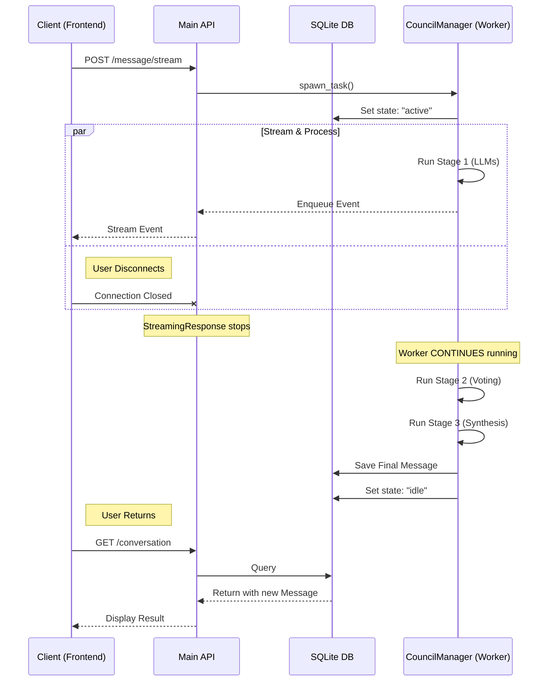

# Async Council Architecture

## The Challenge
We need to decouple long-running LLM orchestration (The Council) from transient HTTP client connections. This ensures:
1.  **Reliability**: Processing continues even if the user disconnects.
2.  **Integrity**: Database state remains consistent regardless of network issues.
3.  **Responsiveness**: The UI receives immediate feedback via streaming, falling back to polling if disconnected.

## Core Concepts

### 1. The Council Manager
A singleton service that manages the lifecycle of `asyncio.Task`s. It allows the HTTP layer to "tap in" to the stream of events without owning the execution process.

### 2. Processing States
We track the lifecycle of a conversation via the `processing_state` field:
*   `idle`: Normal state. Ready for input.
*   `active`: A Council session is actively running in the background.
*   `error`: The last session failed abnormally.

## Data Flow & Resilience

The following sequence illustrates how the system handles a client disconnect. The critical design choice is that **the Worker continues processing** independently of the Client's connection status.

### Execution Steps
1.  **Task Creation**: The backend spawns a detached `asyncio` task for the Council session.
2.  **Streaming**: An `asyncio.Queue` passes events to the HTTP response.
3.  **Disconnect Handling**: If the client drops, the HTTP response terminates, but the detached task ignores the broken queue and proceeds to completion.
4.  **Completion**: The task saves the final result to the database and resets the state to `idle`.

## Future Roadmap
*   **Re-subscription**: Allow clients to reconnect to an active task's live stream.
*   **Job Persistence**: Move queue state to external storage (Redis/SQL) to survive server restarts.
