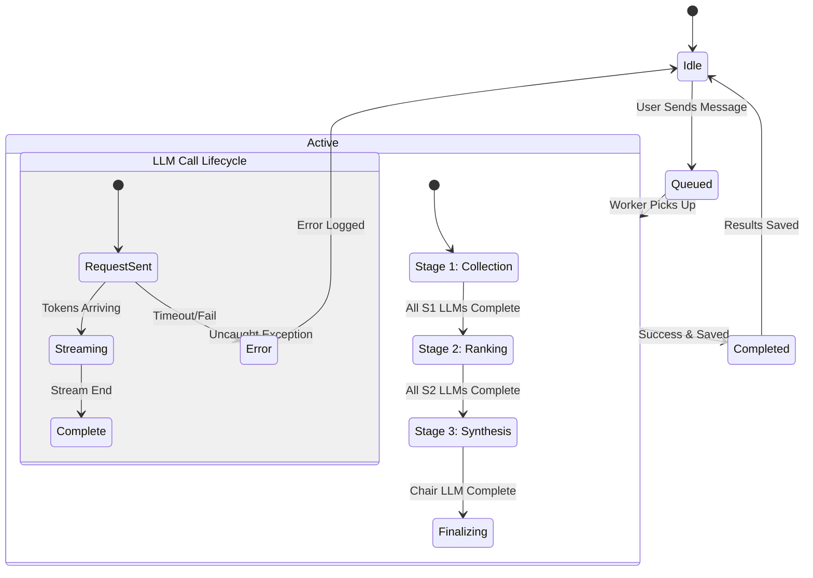
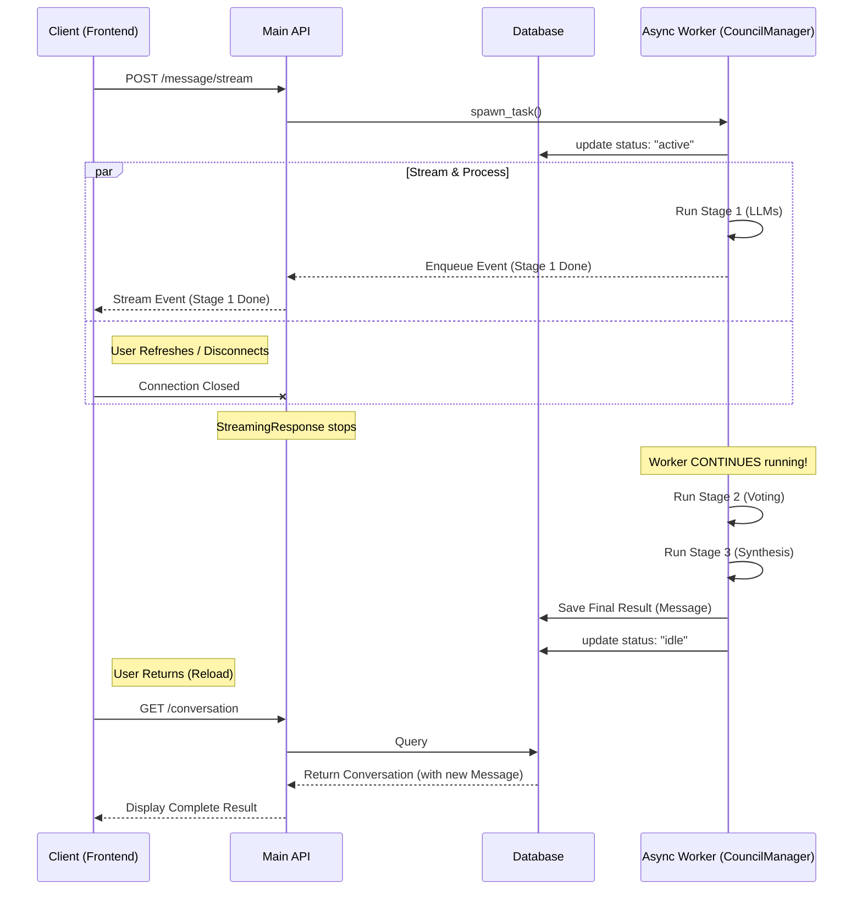

# Async Council Architecture & Flow

## Overview
This document describes the asynchronous architecture used for the "Consulting the Council" process. The goal is to decouple the long-running LLM orchestration from the transient HTTP client connection, ensuring data integrity and allowing for future resumability.

## Core Concepts

### 1. The Council Manager
The `CouncilManager` is a singleton service responsible for:
*   Spawning `asyncio.Task`s for Council sessions.
*   Managing the lifecycle of these tasks.
*   Providing a mechanism (Queues) for the HTTP layer to "tap in" to the stream of events.

### 2. Processing State
The `Conversation` model includes a `processing_state` field to track the lifecycle:
*   `idle`: Normal state. Ready for input or viewing history.
*   `active`: A Council session is currently running in the background.
*   `error`: The last session failed abnormally.

## State Transition Diagram

## Sequence Diagram: Handling Disconnects

This sequence diagram illustrates how the Backend Worker continues processing even if the Client (Frontend) disconnects.

## Data Flow (Phase 1 Implementation)

1.  **Request**: Client POSTs to `/api/conversations/{id}/message/stream`.
2.  **Task Creation**: Backend creates an `asyncio.Queue` and spawns `run_council_task(queue)`.
3.  **Response**: Backend immediately returns a `StreamingResponse` that iterates over the `queue`.
4.  **Disconnect**:
    *   If Client disconnects, the `StreamingResponse` stops iterating.
    *   The `run_council_task` **continues running**. It detects the queue is no longer being consumed (conceptually) or simply ignores it, focusing on completing the LLM calls.
5.  **Completion**:
    *   `run_council_task` finishes Stage 3.
    *   It saves the full message history to the SQLite database.
    *   It updates `processing_state` to `idle`.

## Future Roadmap (Phase 2)
*   **Re-subscription**: Allow clients to connect to an *existing* active task's queue to resume live streaming.
*   **Job Persistence**: Move queue state to Redis/SQL to survive server restarts.
